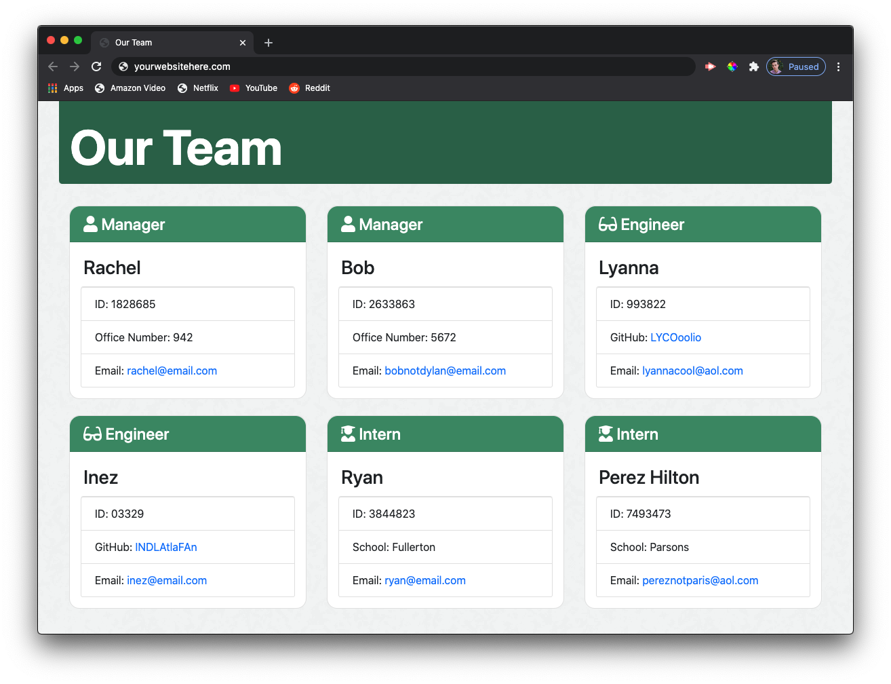

# Employee Page Generator

### Table of Contents
* [Description](#description)
* [Installation](#installation)
* [Usage](#usage)
* [Contributors](#contributors) 
* [Tests](#tests)
* [Questions](#questions)
* [License](#license)

## Description ##

This is a simple command line application that generates a simple employee html document for any tech company all based off of user input. This includes three 'types' of employees, those being: managers, engineers, and interns. I wrote this program primarily to test my understanding of javascript classes and subclasses, but this can be used by anyone that needs a quick and easy way to build an employee page for their website! In general, this saves a lot of time as opposed to building the page from scratch. This application was built using javascript and a few Node.js packages.

### Installation ###

1. Download the .zip file from [here](https://github.com/NTKonzen/Employee-Page-Generator)
1. Unzip the file and relocate it where you like
1. Open the unzipped folder in your preferred command shell
1. Enter 'npm install' to install the dependent packages 

### Usage

1. Navigate to the Employee-Page-Generator file in your preferred command shell
1. Run 'node app'
1. Answer each question to the best of your ability
1. When the program finishes running, grab your newly generated team.html file from the 'output' folder

### Tests

* Run 'npm test' to ensure all methods are working properly

### Contributors

* [Nicholas Konzen](https://github.com/NTKonzen)

### Questions
If you have any questions feel free to contact me on [GitHub](https://github.com/NTKonzen) or email me at nicholaskonzen@gmail.com.

---
#### License

MIT License

Copyright (c) 2020 Nicholas Konzen

Permission is hereby granted, free of charge, to any person obtaining a copy
of this software and associated documentation files (the "Software"), to deal
in the Software without restriction, including without limitation the rights
to use, copy, modify, merge, publish, distribute, sublicense, and/or sell
copies of the Software, and to permit persons to whom the Software is
furnished to do so, subject to the following conditions:

The above copyright notice and this permission notice shall be included in all
copies or substantial portions of the Software.

THE SOFTWARE IS PROVIDED "AS IS", WITHOUT WARRANTY OF ANY KIND, EXPRESS OR
IMPLIED, INCLUDING BUT NOT LIMITED TO THE WARRANTIES OF MERCHANTABILITY,
FITNESS FOR A PARTICULAR PURPOSE AND NONINFRINGEMENT. IN NO EVENT SHALL THE
AUTHORS OR COPYRIGHT HOLDERS BE LIABLE FOR ANY CLAIM, DAMAGES OR OTHER
LIABILITY, WHETHER IN AN ACTION OF CONTRACT, TORT OR OTHERWISE, ARISING FROM,
OUT OF OR IN CONNECTION WITH THE SOFTWARE OR THE USE OR OTHER DEALINGS IN THE
SOFTWARE.
